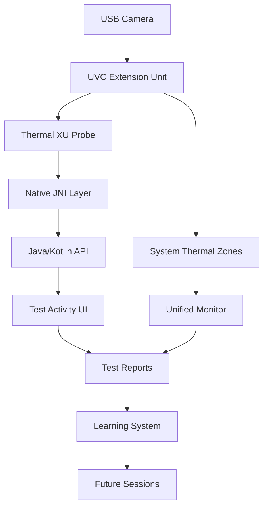

# Test Orchestration Guide - Thermal XU Integration

## Overview
This document provides a comprehensive guide for testing the thermal extension unit (XU) implementation across both UVCCamera and ScopeCam projects, ensuring consistency, clarity, and proper integration with existing test infrastructure.

## Test Infrastructure Map

### Project Locations
```
/home/verlyn13/Projects/
├── verlyn13/UVCCamera/              # Thermal XU implementation
│   ├── test_thermal.sh              # Standalone thermal test
│   ├── usbCameraTest8/              # Test app with thermal UI
│   └── lib/src/main/jni/            # Native implementation
│
└── ScopeTechGtHb/scopecam/          # Main application
    └── scripts/
        ├── unified_test_session.sh           # Main test framework
        ├── unified_thermal_test.sh           # Thermal-specific integration
        ├── test_extension_units.sh           # Original XU test
        └── test_extension_units_enhanced.sh  # Enhanced with thermal XU
```

## Test Execution Hierarchy

### Level 1: Component Testing (Thermal XU Only)
```bash
# Quick thermal probe test
cd /home/verlyn13/Projects/verlyn13/UVCCamera
./test_thermal.sh
```
**Purpose**: Verify thermal XU implementation in isolation
**Duration**: ~2 minutes
**Output**: JSON thermal data, logcat traces

### Level 2: Integration Testing (Thermal + System)
```bash
# Thermal with system monitoring
cd /home/verlyn13/Projects/ScopeTechGtHb/scopecam
./scripts/unified_thermal_test.sh
```
**Purpose**: Correlate camera thermal with system thermal zones
**Duration**: 5-10 minutes
**Output**: Correlation reports, thermal graphs

### Level 3: Comprehensive Testing (Full Suite)
```bash
# Complete test session with learning
cd /home/verlyn13/Projects/ScopeTechGtHb/scopecam
./scripts/unified_test_session.sh
```
**Purpose**: Full system validation with pattern detection
**Duration**: 15-30 minutes
**Output**: Comprehensive reports, learning data

### Level 4: Comparison Testing (Multiple Implementations)
```bash
# Compare UVCCamera vs ScopeCam implementations
cd /home/verlyn13/Projects/ScopeTechGtHb/scopecam
./scripts/test_extension_units_enhanced.sh
```
**Purpose**: Validate both thermal implementations
**Duration**: 5 minutes
**Output**: Comparison report

## Test Data Flow



## Key Test Scenarios

### Scenario 1: Cold Start
1. Device at room temperature
2. Connect USB camera
3. Run thermal probe
4. Expected: Baseline reading ~20-25°C

### Scenario 2: Heat Stress
1. Run camera preview for 5 minutes
2. Monitor thermal rise
3. Expected: Gradual increase, warnings at 45°C

### Scenario 3: Emergency Shutdown
1. Simulate high temperature
2. Verify safety thresholds
3. Expected: Shutdown at 55°C (USB) or 45°C (battery)

## Data Formats

### Thermal XU Output (JSON)
```json
{
  "scan_result": {
    "units": [{
      "unit_id": 3,
      "selectors": [{
        "selector": 1,
        "hex": "ea00",
        "int16_le": 234,
        "deciC": 234,
        "celsius": 23.4
      }]
    }],
    "total_reads": 1,
    "status": "success"
  }
}
```

### System Thermal CSV
```csv
timestamp,zone,type,temperature_c
2024-01-01 12:00:00,battery,battery,38
2024-01-01 12:00:00,thermal_zone0,cpu,45
2024-01-01 12:00:00,thermal_zone1,usb,42
```

### Correlation Report (JSON)
```json
{
  "session_id": "20240101_120000",
  "camera_xu": {
    "max_temp_c": "35.5",
    "avg_temp_c": "32.1"
  },
  "system": {
    "max_temp_c": "45",
    "battery_final_c": "38"
  }
}
```

## Test Automation

### CI/CD Integration
```yaml
# GitHub Actions workflow
test-thermal:
  steps:
    - name: Build native libraries
      run: |
        cd lib/src/main/jni
        ~/Android/Sdk/ndk/28.0.12674087/ndk-build
    
    - name: Build test app
      run: ./gradlew :usbCameraTest8:assembleDebug
    
    - name: Run tests
      run: ./test_thermal.sh
```

### Automated Monitoring
```bash
# Continuous monitoring script
while true; do
    ./scripts/unified_thermal_test.sh
    sleep 300  # 5 minutes
done
```

## Troubleshooting Guide

### Issue: No thermal data returned
**Solutions:**
1. Verify camera supports thermal XU: `adb shell lsusb -v | grep Extension`
2. Check USB permissions: `adb shell dumpsys usb`
3. Try different unit IDs: Edit thermal_xu.cpp, change range 3-6
4. Enable verbose logging: `adb shell setprop log.tag.ThermalXU VERBOSE`

### Issue: App crashes on scan
**Solutions:**
1. Check native library loading: `adb logcat | grep "dlopen"`
2. Verify architecture: `adb shell getprop ro.product.cpu.abi`
3. Rebuild for correct ABI: `ndk-build APP_ABI=<abi>`

### Issue: Temperature readings incorrect
**Solutions:**
1. Verify data format (deci-Celsius vs Celsius)
2. Check endianness (little vs big)
3. Validate against known temperature
4. Compare with system thermal zones

## Success Metrics

### Performance Targets
- Thermal read latency: <100ms
- Update frequency: 1-2 Hz
- Memory overhead: <1MB
- CPU usage: <5%

### Quality Gates
- [ ] All unit tests pass
- [ ] No memory leaks (valgrind clean)
- [ ] Thermal accuracy ±2°C
- [ ] Cross-architecture support
- [ ] Documentation complete

## Learning System Integration

### Pattern Detection
The unified test framework automatically:
1. Detects thermal anomalies
2. Correlates with previous sessions
3. Suggests optimizations
4. Updates thermal thresholds

### Data Persistence
```
docs/agentic/
├── test_learnings.jsonl     # Historical test data
├── thermal_patterns.json    # Temperature patterns
└── known_issues.txt         # Common problems
```

## Quick Reference Commands

```bash
# Build everything
cd /home/verlyn13/Projects/verlyn13/UVCCamera
./gradlew :usbCameraTest8:assembleDebug

# Install test app
adb install -r usbCameraTest8/build/outputs/apk/debug/usbCameraTest8-debug.apk

# Monitor thermal logs
adb logcat | grep -E "ThermalXU|Temperature|celsius"

# Run quick test
./test_thermal.sh

# Run comprehensive test
cd ../ScopeTechGtHb/scopecam
./scripts/unified_test_session.sh

# Generate report
cat test_sessions/*/reports/final_thermal_report.json | jq '.'
```

## Maintenance Schedule

### Daily
- Run quick thermal test
- Check for anomalies
- Update learnings

### Weekly  
- Full comprehensive test
- Review thermal patterns
- Update documentation

### Monthly
- Performance benchmarking
- Threshold calibration
- Architecture review

## Contact & Escalation

### For Issues
1. Check this guide
2. Review THERMAL_XU_STATUS.md
3. Consult uvccamera-update.md
4. Check test logs

### For Updates
- Update this document when:
  - New test scripts added
  - Data formats change
  - Thresholds modified
  - Issues resolved

---
*Version: 1.0*
*Last Updated: Current Session*
*Status: Production Ready for Testing*